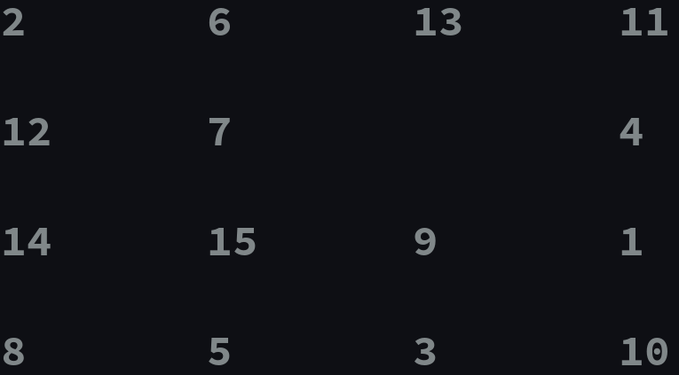

# p15

this is puzzel 15 Game.
You can read about this game :
https://en.wikipedia.org/wiki/15_puzzle

how can run?
============

You can Run this Game like this:

```
python p15
```

befor this you need 'readchar' library


